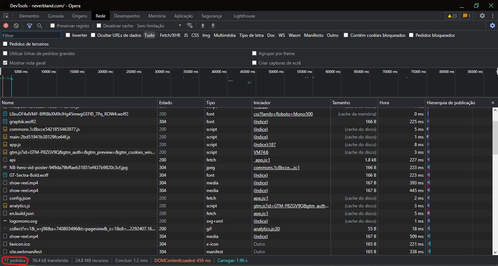
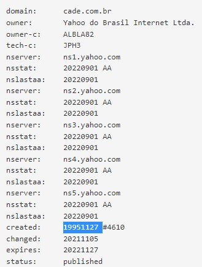

# Aula 01 - Como Funcionam os Sites

Nessa videoaula, [Ricardo Maroquio](https://github.com/maroquio) mostra como funcionam os sites nos bastidores, que tipo de informação trafega entre o navegador do usuário e o servidor web, tudo de uma maneira bem simplificada e didática.

# Tecnologias

# Materiais de Apoio

 - [Práticas Sugeridas da Aula 01.pdf](./Assets/Pr%C3%A1ticas%20Sugeridas%20da%20Aula%2001.pdf)

# Professor Formador

- [@maroquio](https://github.com/maroquio)

# Resolução

