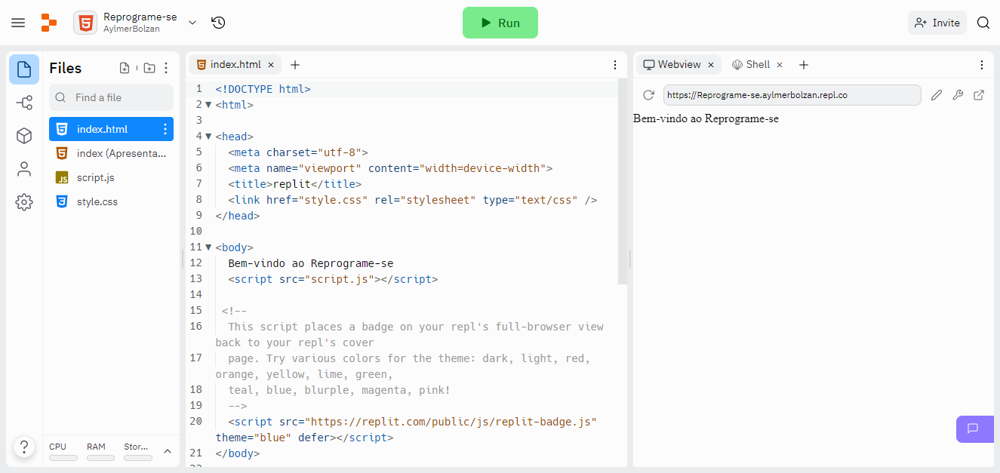

#  Aula 03 - Editores de Código Repl.it e VSCode

Nesta videoaula, [Ricardo Maroquio](https://github.com/maroquio) apresentará os ambientes de desenvolvimento que utilizaremos ao longo do curso. O primeiro deles é o editor online Repl.it, que permite editar e executar códigos-fontes em mais de 50 linguagens de programação, incluindo HTML, CSS e Javascript. Em seguida, é apresentado o Visual Studio Code, um editor de código gratuito e o mais popular da atualidade.

# Tecnologias

# Materiais de Apoio

 - [Práticas Sugeridas da Aula 03.pdf](./Assets/Pr%C3%A1ticas%20Sugeridas%20da%20Aula%2003.pdf)
 
 
# Professor Formador

- [@maroquio](https://github.com/maroquio)

# Resolução

