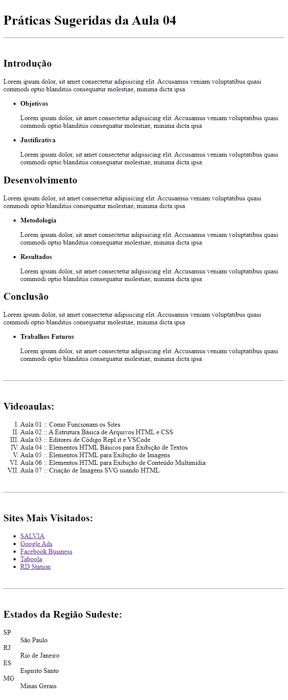

# Aula 04 - Elementos HTML Básicos para Exibição de Textos

Nesta videoaula, [Ricardo Maroquio](https://github.com/maroquio) mostra os elementos HTML textuais básicos, incluindo elementos para títulos e subtítulos, parágrafos, listas, links, apresentação de código-fonte, entre outros. Além de mostrar como utilizar cada tipo de elemento, também fala a respeito da questão semântica de cada elemento.

# Tecnologias

# Materiais de Apoio

 - [Práticas Sugeridas da Aula 04.pdf](./Assets/Pr%C3%A1ticas%20Sugeridas%20da%20Aula%2004.pdf)
 
 
# Professor Formador

- [@maroquio](https://github.com/maroquio)

# Resolução

