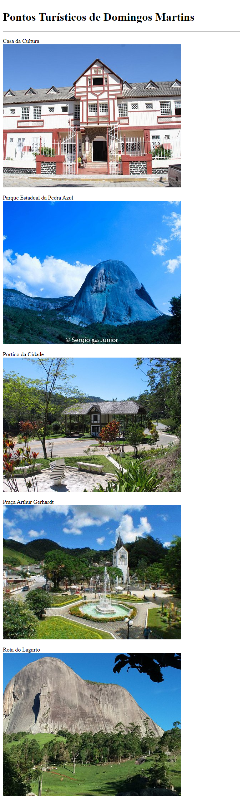

# Aula 05 - Elementos HTML para Exibição de Imagens

Nesta videoaula, [Ricardo Maroquio](https://github.com/maroquio) mostra os elementos HTML usados para se exibir imagens, principalmente o elemento "img". Mostra também as diferenças entre imagens comuns e vetoriais, as formas de se mapear uma imagem em regiões clicáveis usando o elemento "map", e um recurso que permite carregar imagens específicas para determinadas resoluções de tela usando o elemento "picture".

# Tecnologias

# Materiais de Apoio

 - [Práticas Sugeridas da Aula 05.pdf](./Assets/Pr%C3%A1ticas%20Sugeridas%20da%20Aula%2005.pdf)
 
 
# Professor Formador

- [@maroquio](https://github.com/maroquio)

# Resolução

