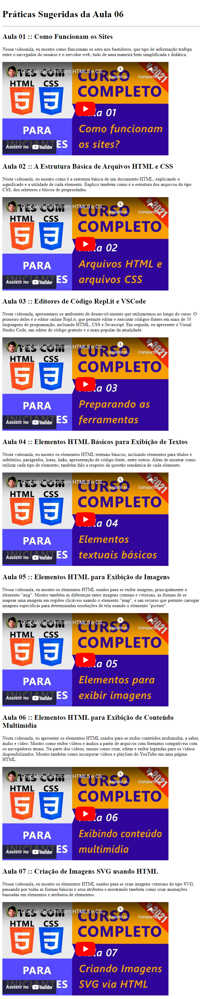

# Aula 06 - Elementos HTML para Exibição de Conteúdo Multimídia

Nesta videoaula, [Ricardo Maroquio](https://github.com/maroquio) apresenta os elementos HTML usados para se exibir conteúdos multimídia, a saber, áudio e vídeo. Mostra como exibir vídeos e áudios a partir de arquivos com formatos compatíveis com os navegadores atuais. Na parte dos vídeos, ensina como criar, editar e exibir legendas para os vídeos disponibilizados. Mostra também como incorporar vídeos e playlists do YouTube em uma página HTML.

# Tecnologias

# Materiais de Apoio

 - [Práticas Sugeridas da Aula 06.pdf](./Assets/Pr%C3%A1ticas%20Sugeridas%20da%20Aula%2006.pdf)
 
 
# Professor Formador

- [@maroquio](https://github.com/maroquio)

# Resolução

