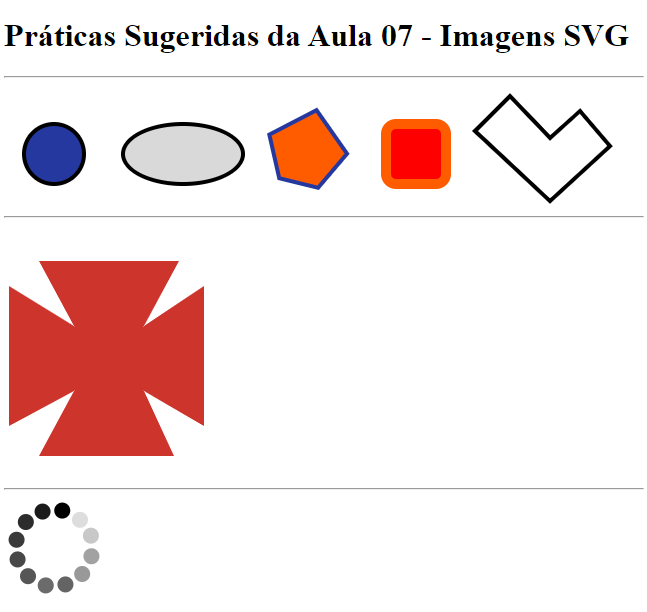

# Aula 07 - Criação de Imagens SVG usando HTML

Nesta videoaula, [Ricardo Maroquio](https://github.com/maroquio) mostra os elementos HTML usados para se criar imagens vetoriais do tipo SVG, passando por todas as formas básicas e seus atributos e mostrando também como criar animações baseadas em elementos e atributos de elementos.

# Tecnologias

# Materiais de Apoio

 - [Práticas Sugeridas da Aula 07.pdf](./Assets/Pr%C3%A1ticas%20Sugeridas%20da%20Aula%2007.pdf)
 
 
# Professor Formador

- [@maroquio](https://github.com/maroquio)

# Resolução

