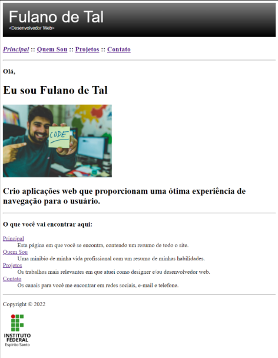
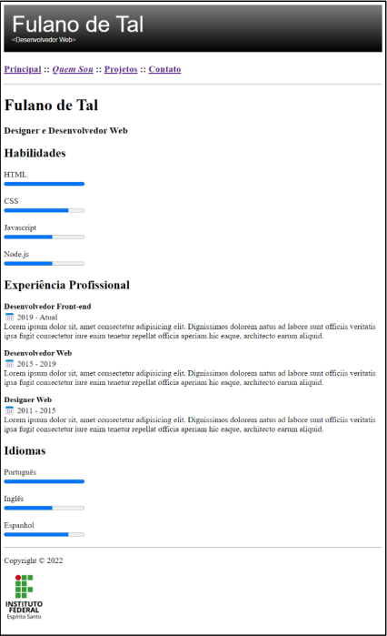
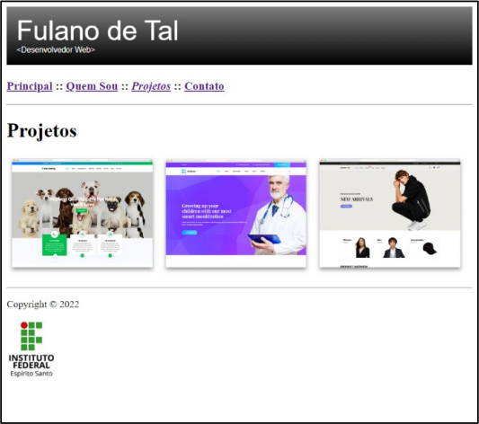
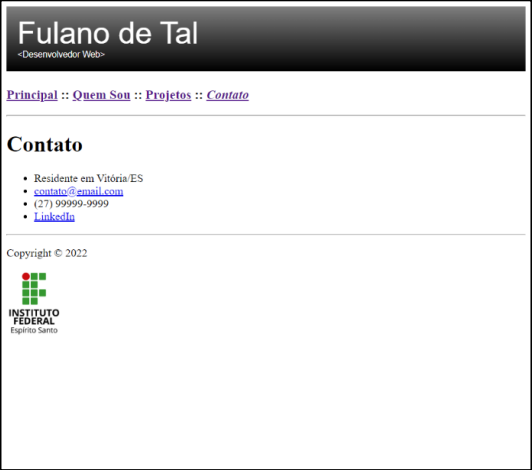
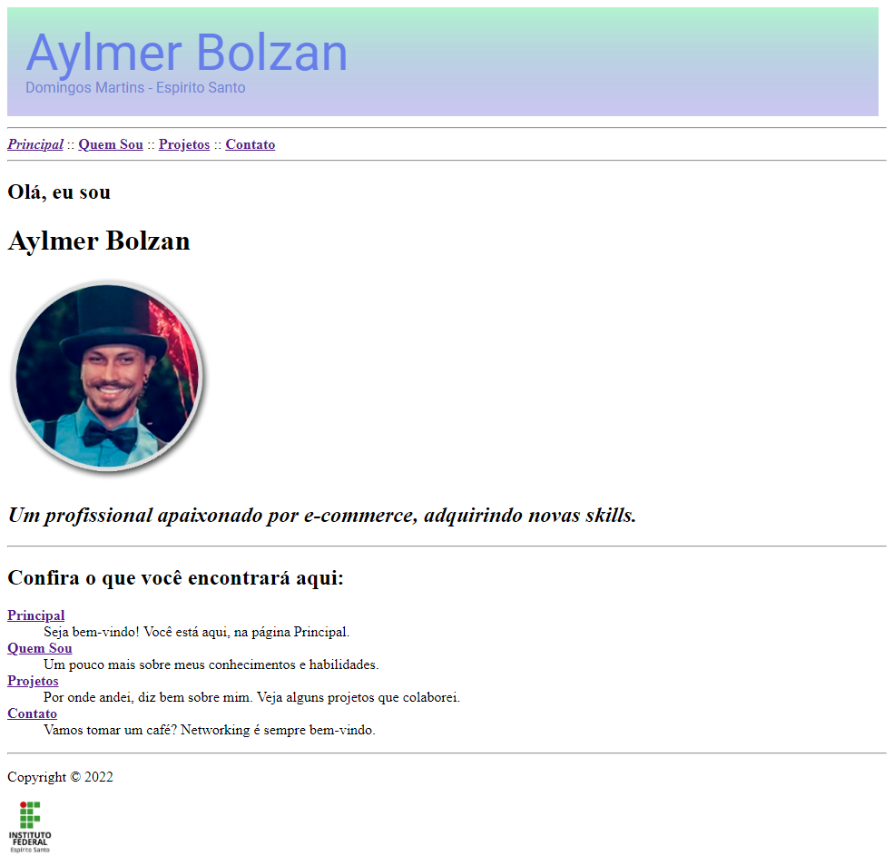
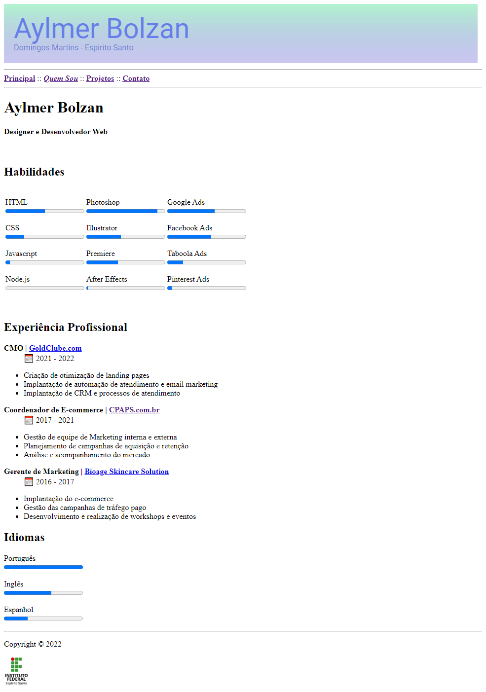
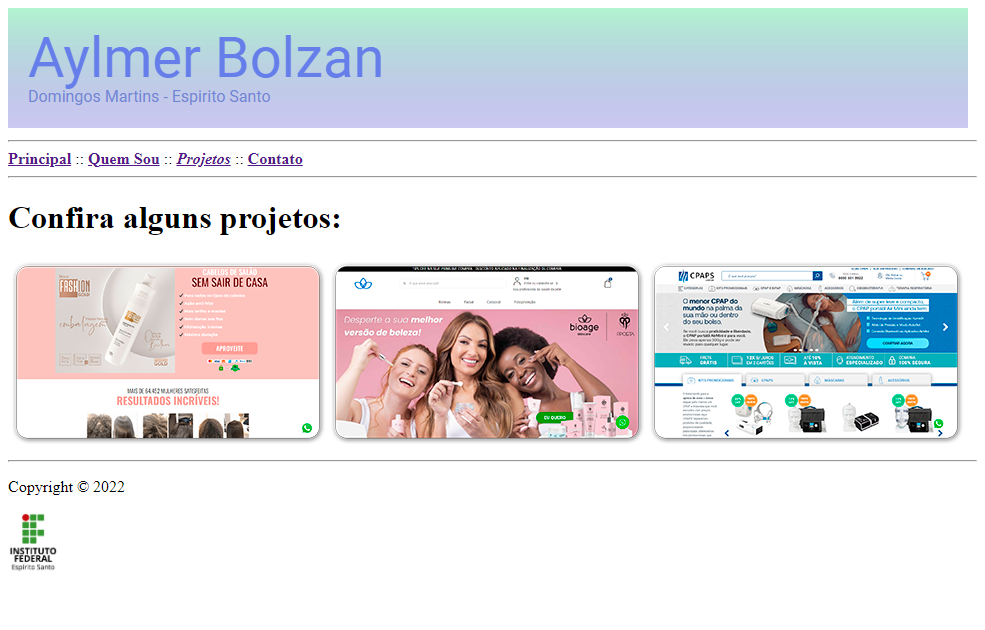
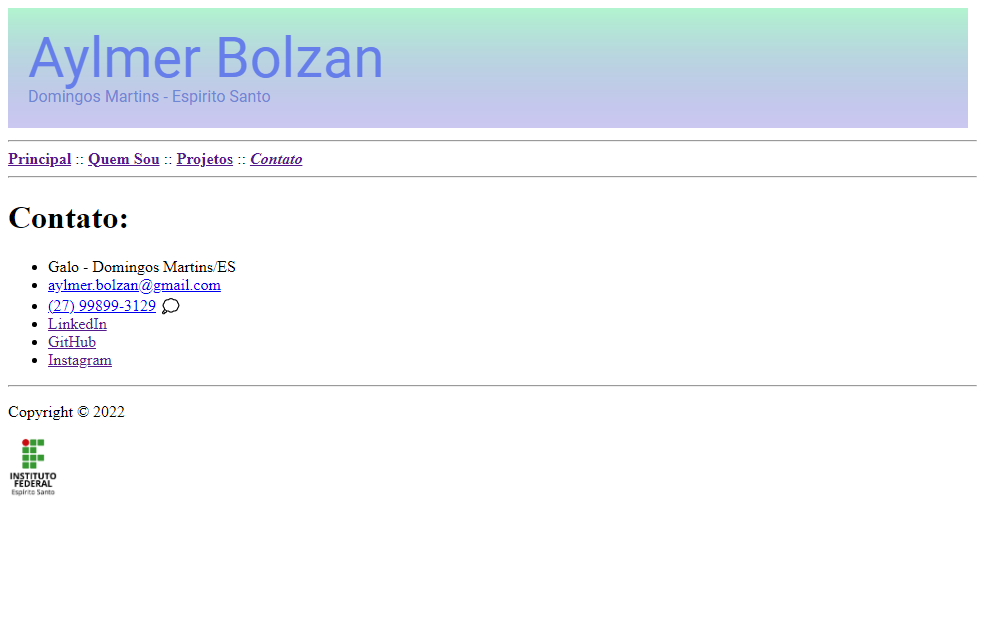

# Trabalho Prático da 1ª Semana

Um dos sites mais importantes para um programador profissional é aquele para expor o seu portfólio. Trata-se de algo essencial para ser notado e para estabelecer sua presença online, mostrando habilidades, projetos em que participou e disponibilizando canais para contato. Um portfólio pode te ajudar a encontrar um trabalho, um estágio ou um programa de bolsa de estudos. Portanto, vamos entender como se constrói um site de portfólio simples.

Um site de portfólio deve ter ao menos 4 elementos essenciais: uma hero section, que é uma seção que mostra de forma destacada o perfil do profissional e convida o usuário a alguma ação; uma seção com informações sobre as habilidades relevantes do profissional; uma seção informando os projetos mais relevantes em que o profissional já atuou; e, por fim, uma seção que apresente todos os canais de contato possíveis para se comunicar com o profissional.

As imagens a seguir são de um site de portfólio pessoal que usa somente os elementos HTML que foram vistos ao longo do conteúdo dessa semana. Crie um site com 4 páginas visualmente idênticas às das figuras mostradas ao fim desse documento. Lembre-se de usar as boas práticas mencionadas ao longo das aulas, incluindo a preocupação com a semântica dos elementos HTML. Abaixo do enunciado da atividade, na sala virtual, tem um link para download das imagens utilizadas nesse projeto. Agora vamos a algumas dicas importantes que você deve observar ao construir as páginas:

1) O cabeçalho é uma imagem SVG que está entre as imagens desse projeto. Essa imagem deve ser aberta em modo texto para que seja possível substituir o nome “Fulano de Tal” pelo seu nome e para trocar as cores do degradê.

2) Cada item do menu deve abrir a página correspondente ao seu título e deve ficar em itálico quando corresponder à página corrente.

3) Substitua a foto da página principal por outra de sua preferência. De preferência, use uma foto sua. Se não tiver uma boa foto no momento, você pode encontrar outras boas fotos em https://www.pexels.com/.

4) As barras de progresso usadas na página “Quem Sou” usam o elemento HTML ```<progress>``` com valor mínimo de 1 e valor máximo de 5. Como os vídeos não abordaram esse elemento, pesquise sobre ele para utilizá-lo corretamente.

5) As imagens de calendário da página “Quem Sou” usam a entidade HTML “```&#x1f4c5;```” .

Agora veja, no restante desse documento, as capturas de tela das páginas prontas e dê o seu melhor para conseguir reproduzir o que é mostrado.

<details>
<summary>Exibir imagens do enunciado da atividade</summary>

<center>



</center>

<center>



</center>

<center>



</center>

<center>



</center>

</details>

# Resultado Obtido

<details>
<summary>Exibir imagens da atividade executada</summary>

<center>



</center>

<center>



</center>

<center>



</center>

<center>



</center>

</details>