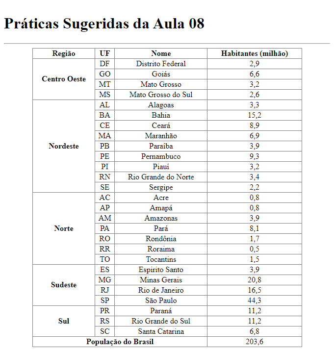

# Aula 08 - Exibição de Dados em Tabelas

Nesta videoaula, [Ricardo Maroquio](https://github.com/maroquio) mostra os elementos HTML usados para se exibir dados de forma tabular. Mostra como organizar a tabela semanticamente e como usar atributos para promover algumas configurações visuais na tabela.

# Tecnologias

# Materiais de Apoio

 - [Práticas Sugeridas da Aula 08.pdf](./Assets/Pr%C3%A1ticas%20Sugeridas%20da%20Aula%2008.pdf)
 
# Professor Formador

- [@maroquio](https://github.com/maroquio)

# Resolução

