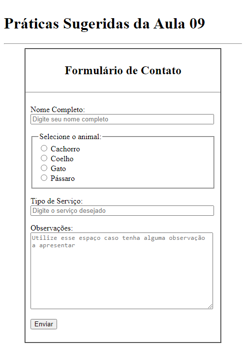

# Aula 09 - Criação de Formulários HTML para Envio de Dados

Nesta videoaula, [Ricardo Maroquio](https://github.com/maroquio) mostra os elementos HTML usados para se criar formulários com campos de diversos tipos para se enviar dados à uma aplicação web que irá processar esses dados e devolver uma resposta ao usuário.

# Tecnologias

# Materiais de Apoio

 - [Práticas Sugeridas da Aula 09.pdf](./Assets/Pr%C3%A1ticas%20Sugeridas%20da%20Aula%2009.pdf)
 
# Professor Formador

- [@maroquio](https://github.com/maroquio)

# Resolução

