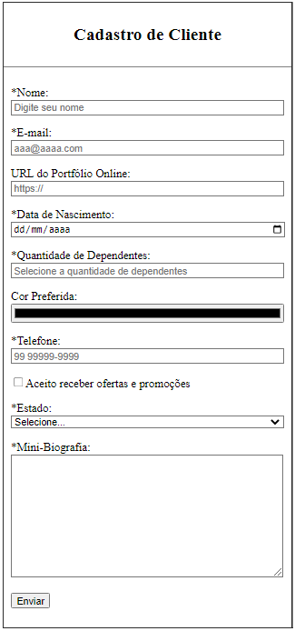

# Aula 10 - Tipos de Campos em Formulários HTML

Nesta videoaula, [Ricardo Maroquio](https://github.com/maroquio) mostra os diferentes tipos de campos possíveis de serem adicionados a um formulário utilizando elementos do tipo INPUT, incluindo campos para e-mail, senha, url, telefone, datas, entre outros. Mostro também diversos recursos usados para validação de campos pelo próprio navegador.

# Tecnologias

# Materiais de Apoio

 - [Práticas Sugeridas da Aula 10.pdf](./Assets/Pr%C3%A1ticas%20Sugeridas%20da%20Aula%2010.pdf)
 
# Professor Formador

- [@maroquio](https://github.com/maroquio)

# Resolução

