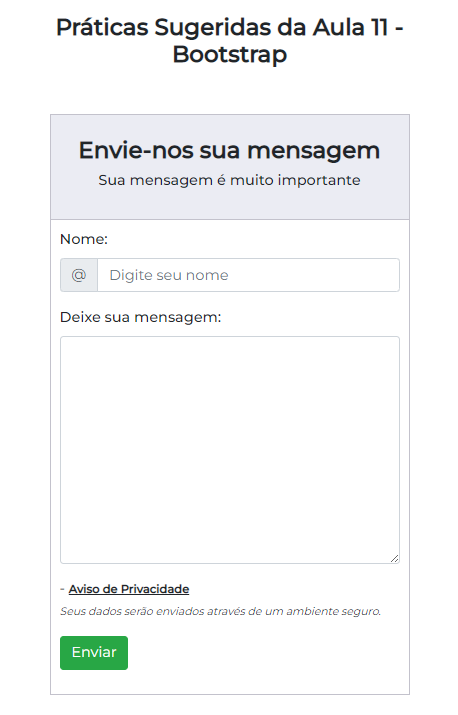
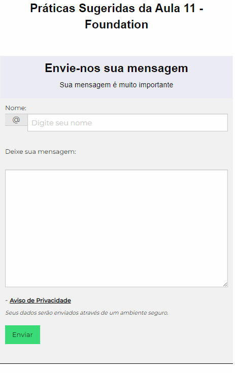
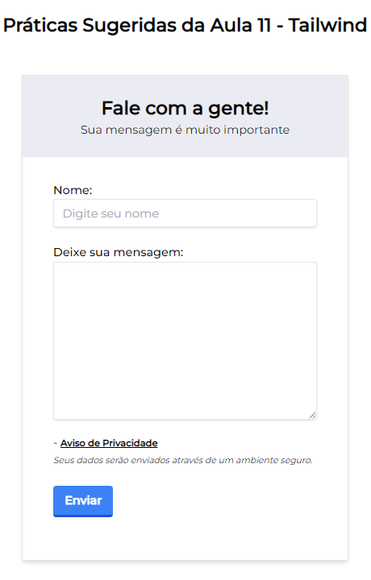

# Aula 11 - Associação de CSS a Documentos HTML e Seletores

Nesta videoaula, [Ricardo Maroquio](https://github.com/maroquio) mostra as diferentes formas de se associar códigos CSS a um documento HTML. Em seguida, apresenta os principais seletores CSS baseados em tipos, classes e ids, incluindo seletores agrupados e seletores de elementos relacionados.

# Tecnologias

# Materiais de Apoio

 - [Práticas Sugeridas da Aula 11.pdf](./Assets/Pr%C3%A1ticas%20Sugeridas%20da%20Aula%2011.pdf)
 
# Professor Formador

- [@maroquio](https://github.com/maroquio)

# Resolução

