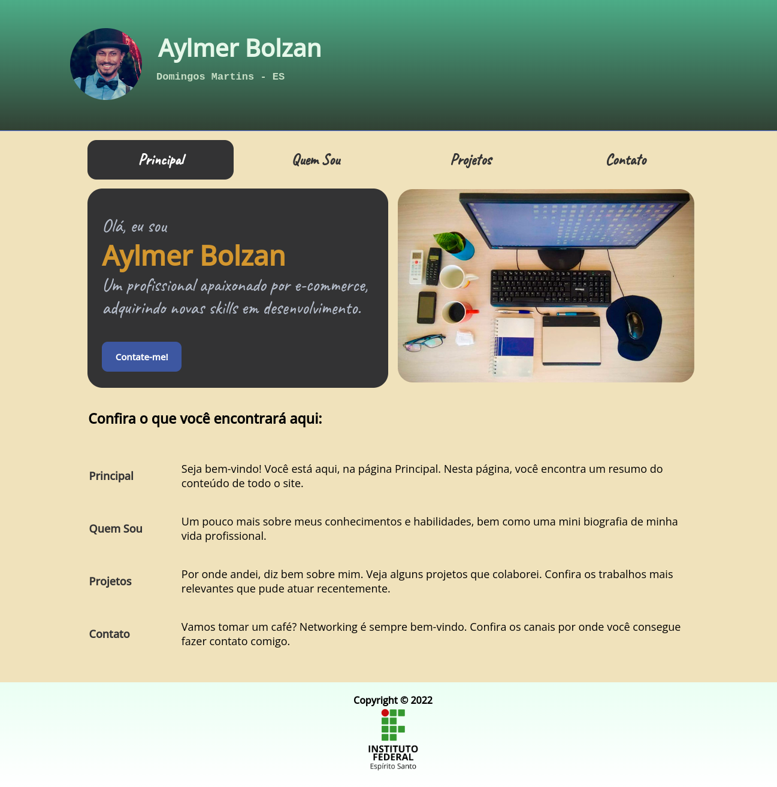

# Trabalho Prático da 2ª Semana

Nessa atividade, você vai colocar em prática todo o conteúdo abordado ao longo da semana em uma única atividade integrada. Siga as instruções do enunciado do trabalho corretamente, observando como deve ser criado o arquivo a ser enviado.

# Tecnologias

# Materiais de Apoio

 - [Enunciado do Trabalho Prático da 2ª Semana.pdf](./Assets/Enunciado%20do%20Trabalho%20Prático%20da%202ª%20Semana.pdf)
 
 
# Professor Formador

- [@maroquio](https://github.com/maroquio)

# Resolução

