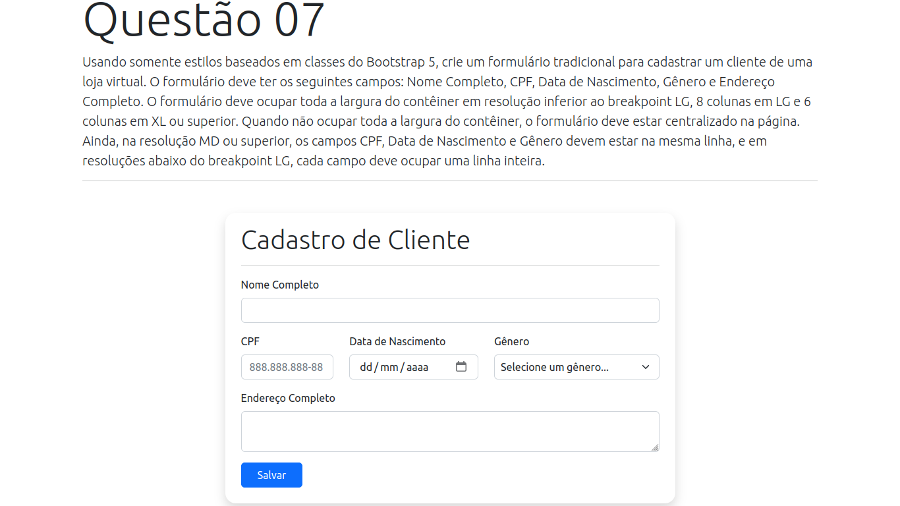

# Trabalho Prático da 3ª Semana

Nessa atividade, você vai colocar em prática todo o conteúdo abordado ao longo da semana em uma única atividade integrada. 

# Tecnologias

 
# Professor Formador

- [@maroquio](https://github.com/maroquio)

# Resolução

