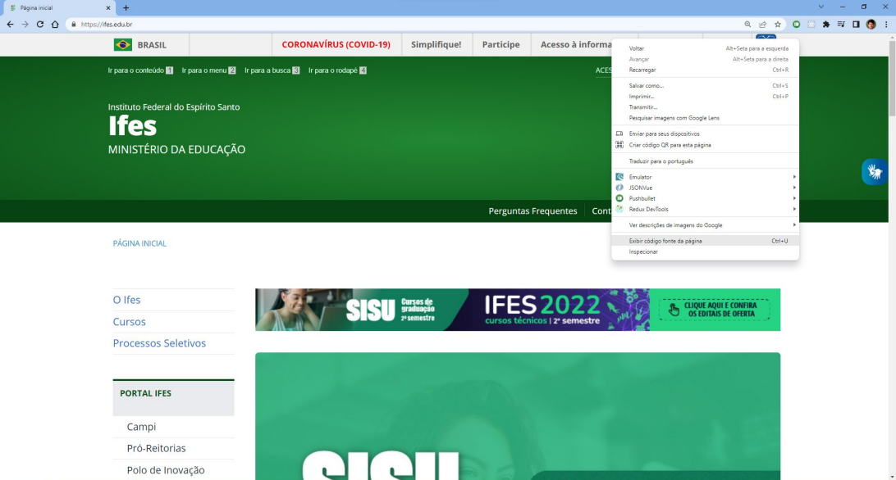
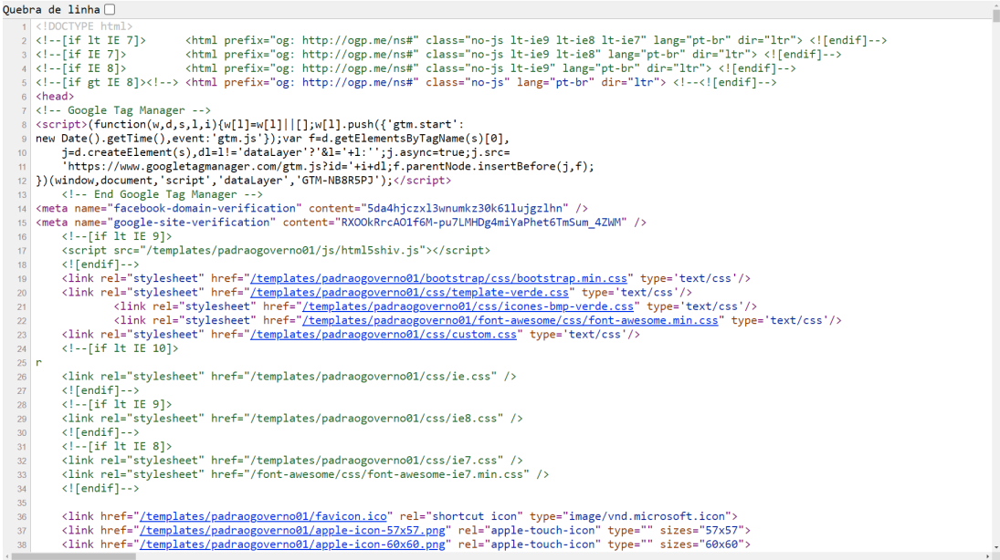

# Aula 02: A Estrutura Básica de Arquivos HTML e CSS

Nesta videoaula, [Ricardo Maroquio](https://github.com/maroquio) mostra como é a estrutura básica de um documento HTML, explicando o significado e a utilidade de cada elemento. Explica também como é a estrutura dos arquivos do tipo CSS, dos seletores e blocos de propriedades.

# Práticas Sugeridas da Aula 02

Acesse o site https://ifes.edu.br e, depois da página renderizada, exiba o código-fonte clicando com o botão direito do mouse sobre a página e selecionando a opção “Exibir código fonte da página”, conforme a figura a seguir:

Na janela que mostra o código-fonte, veja que, dentro da tag HEAD, essa página faz 5 referências diretas para arquivos CSS, conforme mostra a figura a seguir. Explore o código-fonte de pelo menos outros 3 sites e verifique quantos arquivos CSS são referenciados dentro da tag HEAD de cada um deles.

