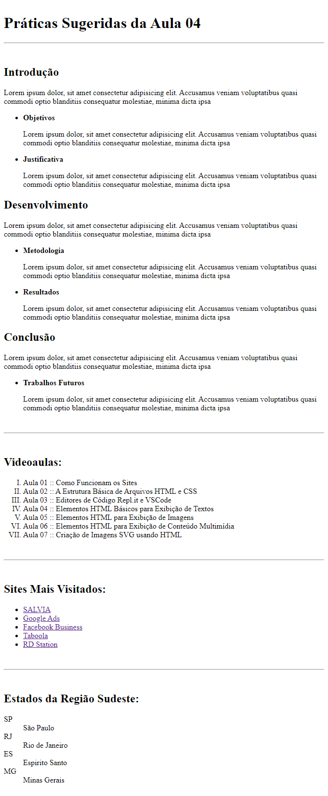

# Aula 04: Elementos HTML Básicos para Exibição de Textos

Nesta videoaula, [Ricardo Maroquio](https://github.com/maroquio) mostra os elementos HTML textuais básicos, incluindo elementos para títulos e subtítulos, parágrafos, listas, links, apresentação de código-fonte, entre outros. Além de mostrar como utilizar cada tipo de elemento, também fala a respeito da questão semântica de cada elemento.

# Práticas Sugeridas da Aula 04

1. Grosso modo, a semântica de um elemento HTML diz respeito ao seu significado ou sua intenção no código-fonte da página. Isso não tem a ver com seu aspecto visual. Na verdade, a semântica diz respeito ao tipo de conteúdo que o elemento contém. Pode ser um cabeçalho, um rodapé etc. O artigo disponível em https://www.freecodecamp.org/portuguese/news/elementos-semanticos-do-html5-explicados/ apresenta uma explicação sobre alguns elementos HTML com semântica bastante objetiva. Pesquise quais elementos que não existiam na HTML4 e que foram incluídos na HTML5 apenas para fins semânticos.

2. Imagine que você tenha que escrever um artigo usando HTML para formatá-lo. Esse artigo tem as seções primárias Introdução, Desenvolvimento e Conclusão. A Introdução tem as seções secundárias Objetivos e Justificativa. O Desenvolvimento tem as seções secundárias Metodologia e Resultados. A Conclusão tem apenas a seção secundária “Trabalhos Futuros”. Crie um código HTML para representar essa hierarquia de seções, sendo que cada seção deve ter um parágrafo com pelo menos 20 palavras quaisquer.

3. Utilize os elementos HTML de listas para criar uma lista não ordenada contendo os títulos das videoaulas dessa semana. Em seguida, altere o código para que a lista passe a ser ordenada usando algarismos romanos.

4. Crie um código HTML que contenha uma lista não ordenada de links para os 5 sites que você mais visita no seu cotidiano.

5. Crie um código HTML contendo uma lista de definições para todos os estados da região em que você nasceu (norte, nordeste, sul, sudeste ou centro-oeste), contendo a sigla e sua respectiva definição.

# Resultado Obtido

