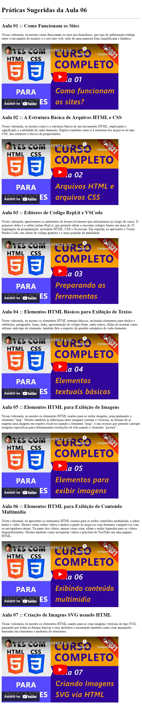

# Aula 06: Elementos HTML para Exibição de Conteúdo Multimídia

Nesta videoaula, [Ricardo Maroquio](https://github.com/maroquio) apresenta os elementos HTML usados para se exibir conteúdos multimídia, a saber, áudio e vídeo. Mostra como exibir vídeos e áudios a partir de arquivos com formatos compatíveis com os navegadores atuais. Na parte dos vídeos, ensina como criar, editar e exibir legendas para os vídeos disponibilizados. Mostra também como incorporar vídeos e playlists do YouTube em uma página HTML.

# Práticas Sugeridas da Aula 06

Agora que você aprendeu a incorporar vídeos do YouTube em uma página HTML, cria uma página contendo os vídeos desse módulo separados por semana, usando somente os recursos HTML que estudamos até o momento. Quando concluir, faça uma captura de imagem da página utilizando a extensão GoFullPage do Chrome (https://chrome.google.com/webstore/detail/gofullpage-full-page-scre/fdpohaocaechififmbbbbbknoalclacl), e publique no fórum para que vejamos como ficou sua galeria de vídeos.

# Resultado Obtido

