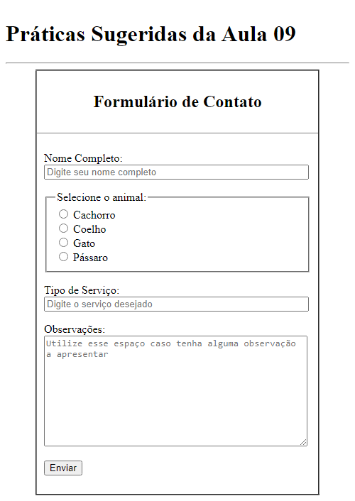

# Aula 09: Criação de Formulários HTML para Envio de Dados

Nesta videoaula, [Ricardo Maroquio](https://github.com/maroquio) mostra os elementos HTML usados para se criar formulários com campos de diversos tipos para se enviar dados à uma aplicação web que irá processar esses dados e devolver uma resposta ao usuário.

# Práticas Sugeridas da Aula 09

1. É muito comum os sites solicitarem um cadastro para que um usuário possa acessar áreas protegidas, contendo alguma informação adicional. Analise o formulário de cadastro de usuários de pelo menos 3 sites e identifique quais campos esses formulários possuem para o usuário digitar.

2. Imagine que você trabalhe em um pet shop e o proprietário peça para você adicionar ao site uma página em que o cliente possa solicitar o orçamento de determinado serviço. A página deve ter um formulário com os seguintes campos:

- Nome do dono (digitação livre de linha única)
- Tipo de animal (cachorro, coelho, gato ou pássaro)
- Tipo de serviço (digitação livre de linha única)
- Observações (digitação livre de múltiplas linhas)

O formulário deve ter um botão que submeta os dados via POST para o endereço “/contato/cotar”.

# Resultado Obtido

