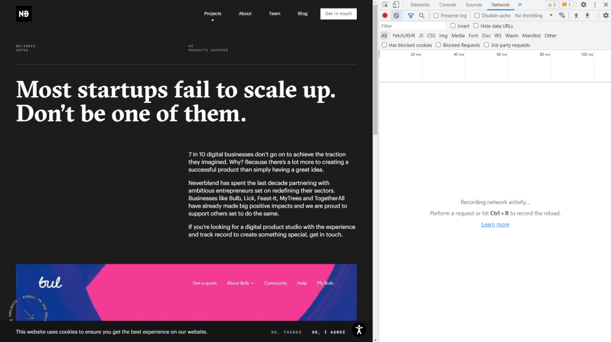

# Aula 01: Como Funcionam os Sites

Nessa videoaula, [Ricardo Maroquio](https://github.com/maroquio) mostra como funcionam os sites nos bastidores, que tipo de informação trafega entre o navegador do usuário e o servidor web, tudo de uma maneira bem simplificada e didática.

# Práticas Sugeridas da Aula 01

1. Visite o site https://neverbland.com usando o navegador Chrome. Assim que o site estiver aberto, pressione a tecla F12. Na janela que se abre, localize a guia “Rede” (ou Network). Veja a figura a seguir:

 
Assim que obtiver essa visualização, recarregue a página e observe que a parte branca será preenchida com várias linhas. Cada uma dessas linhas é uma requisição a um recurso de um servidor web. Observe que, para cada requisição, é possível saber o nome do recurso requisitado, o status da resposta recebida, o tipo do recurso e seu tamanho, bem como seu tempo de carregamento. Tente analisar esses dados e, ao fim, veja quantos recursos foram carregados pelo navegador para exibir apenas essa página web.

2. Sempre que digitamos um nome de domínio na barra de endereços do navegador para consultar um site, esse nome é traduzido para um número IP que, por sua vez, corresponde ao endereço único de um computador servidor estabelecido em algum lugar do planeta. Entre no site https://whois.domaintools.com e pesquise pelo nome de domínio “ifes.edu.br”. Você conseguirá ver uma série de informações sobre o domínio, conforme mostra a figura abaixo. Faça uma pesquisa pelos domínios mais antigos do Brasil e poste no fórum qual foi o domínio mais antigo que encontrou. Veja que o domínio “ifes.edu.br” foi registrado no dia 03/03/1998. Será que consegue encontrar um mais antigo?

