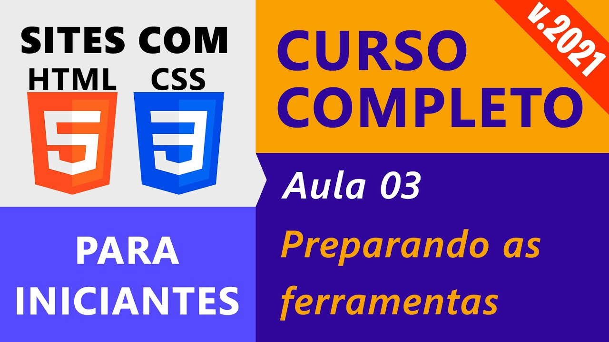

# Aula 03: Editores de Código Repl.it e VSCode

Nesta videoaula, [Ricardo Maroquio](https://github.com/maroquio) apresentará os ambientes de desenvolvimento que utilizaremos ao longo do curso. O primeiro deles é o editor online Repl.it, que permite editar e executar códigos-fontes em mais de 50 linguagens de programação, incluindo HTML, CSS e Javascript. Em seguida, é apresentado o Visual Studio Code, um editor de código gratuito e o mais popular da atualidade.

# Práticas Sugeridas da Aula 03

1. Registre uma conta no Repl.it para você e crie um projeto do tipo “HTML, CSS, JS” chamado “Reprograme-se”. Você será apresentado ao editor online do Repl.it contendo 3 arquivos: index.html, scripts.js e styles.css. Localize o texto “Hello world” do arquivo index.html e altere-o para “Bem-vindo ao Reprograme-se”. Em seguida pressione o botão verde “Run” na parte superior do editor ou use a combinação de teclas “Ctrl+S” para aplicar as alterações. Veja que agora a aba “Output”, à direita, mostra o novo resultado, conforme a figura a seguir:

2. O Visual Studio Code é um editor de código gratuito, multiplataforma e de código aberto. Uma grande diferença dele para o Repl.it é que ele deve ser baixado e instalado em seu computador. Existem alternativas interessantes que também requerem instalação no computador, como o Sublime, o Atom e o Brackets. Leia o artigo disponível em https://kinsta.com/pt/blog/melhores-editores-texto/ e veja as principais características dos editores de código mais populares disponíveis na atualidade. Caso tenha se identificado com algum outro editor diferente do Visual Studio Code, fique à vontade para utilizá-lo ao longo do curso.

3. O arquivo PDF disponível no link https://code.visualstudio.com/shortcuts/keyboard-shortcuts-windows.pdf contém uma série de atalhos de teclado para acessar as funções do Visual Studio Code. Tente localizar os atalhos para as seguintes funções, que são úteis para o dia a dia de quem cria sites, e tente utilizá-las no Visual Studio Code:

- Salvar o arquivo atual (Save)
- Criar um novo arquivo (New File)
- Mostrar/ocultar a barra lateral (Toggle sidebar visibility)
- Formatar o documento (Format document)
- Ampliar/reduzir o zoom (Zoom in/out)
- Mostrar o terminal (Show integrated terminal)
