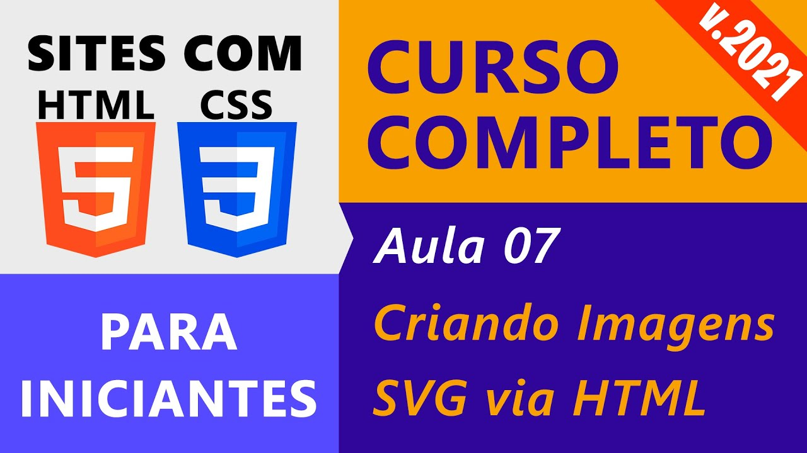
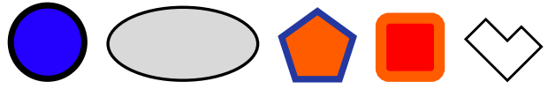
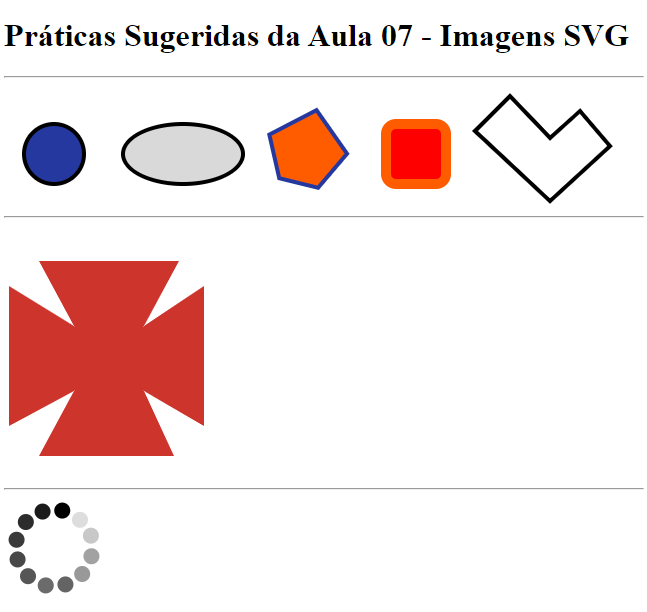

# Aula 07: Criação de Imagens SVG usando HTML

Nesta videoaula, [Ricardo Maroquio](https://github.com/maroquio) mostra os elementos HTML usados para se criar imagens vetoriais do tipo SVG, passando por todas as formas básicas e seus atributos e mostrando também como criar animações baseadas em elementos e atributos de elementos.

# Práticas Sugeridas da Aula 07

1. Usando HTML, crie imagens SVG semelhantes às mostradas nas figuras a seguir

2. Adicione uma animação à figura do pentágono acima para que ele gire continuamente.

3. Usando figura do tipo polígono, crie uma imagem SVG semelhante à da figura a seguir:

4. DESAFIO! Faça uma imagem animada de carregamento, conforme a imagem a seguir, que fique girando continuamente.

# Resultado Obtido

