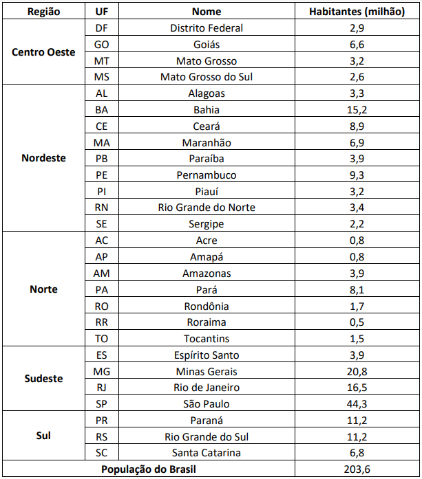
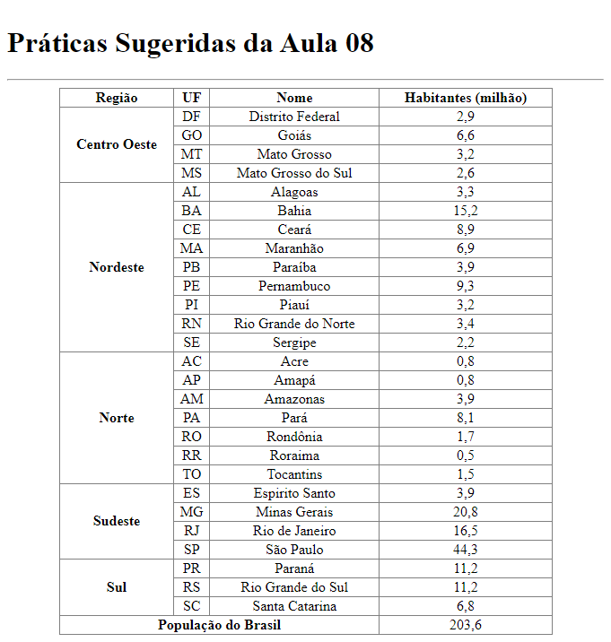

# Aula 08: Exibição de Dados em Tabelas

Nesta videoaula, [Ricardo Maroquio](https://github.com/maroquio) mostra os elementos HTML usados para se exibir dados de forma tabular. Mostra como organizar a tabela semanticamente e como usar atributos para promover algumas configurações visuais na tabela.

# Práticas Sugeridas da Aula 08

- Crie uma tabela contendo todos os estados da federação. A tabela deve conter 3 colunas: Região, Sigla, Nome e População. A figura a abaixo mostra um exemplo de como deve ficar a tabela. Não se esqueça de usar os elementos semânticos para cabeçalho, corpo e rodapé da tabela.

# Resultado Obtido

