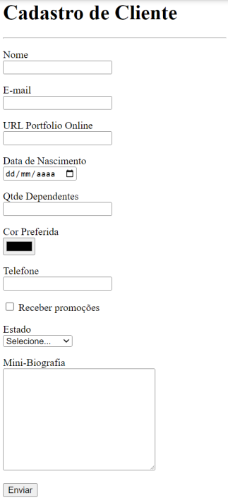
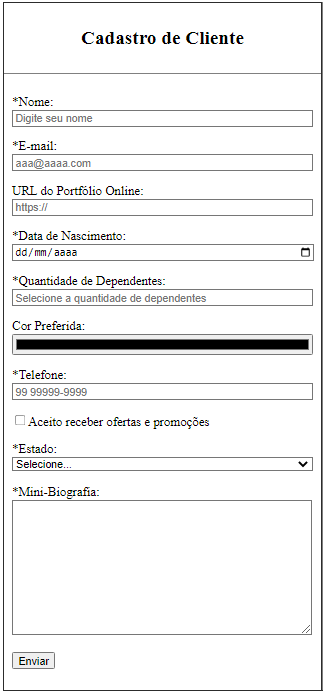

# Aula 10: Tipos de Campos em Formulários HTML

Nesta videoaula, [Ricardo Maroquio](https://github.com/maroquio) mostra os diferentes tipos de campos possíveis de serem adicionados a um formulário utilizando elementos do tipo INPUT, incluindo campos para e-mail, senha, url, telefone, datas, entre outros. Mostro também diversos recursos usados para validação de campos pelo próprio navegador.

# Práticas Sugeridas da Aula 10

1. O formulário HTML mostrado na figura a seguir contém 10 tipos diferentes de campos de entrada de dados. Faça o código HTML desse formulário, considerando que ele deve ser enviado para o endereço “/cliente/cadastrar”

# Resultado Obtido

